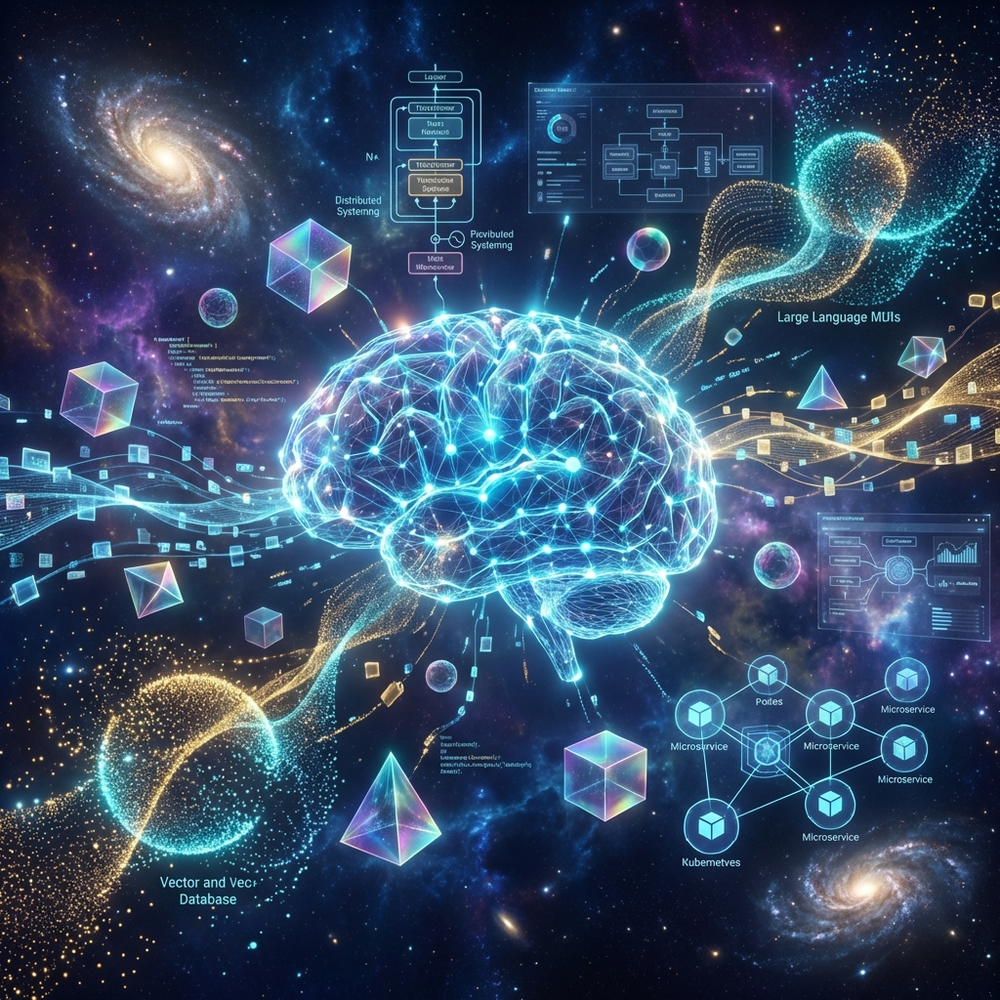
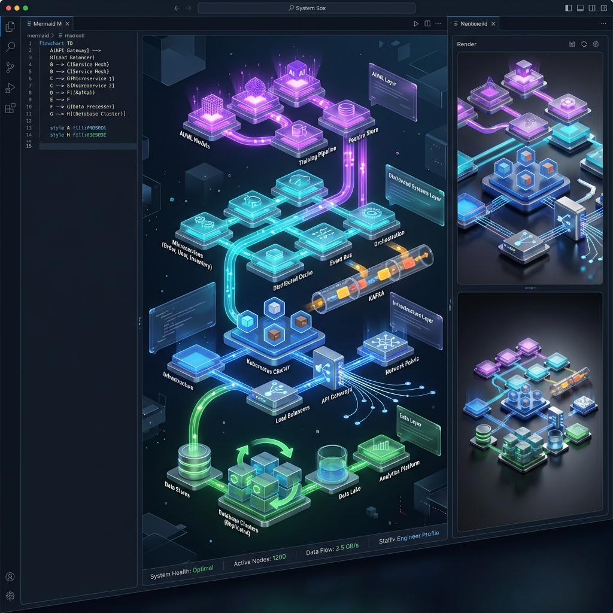
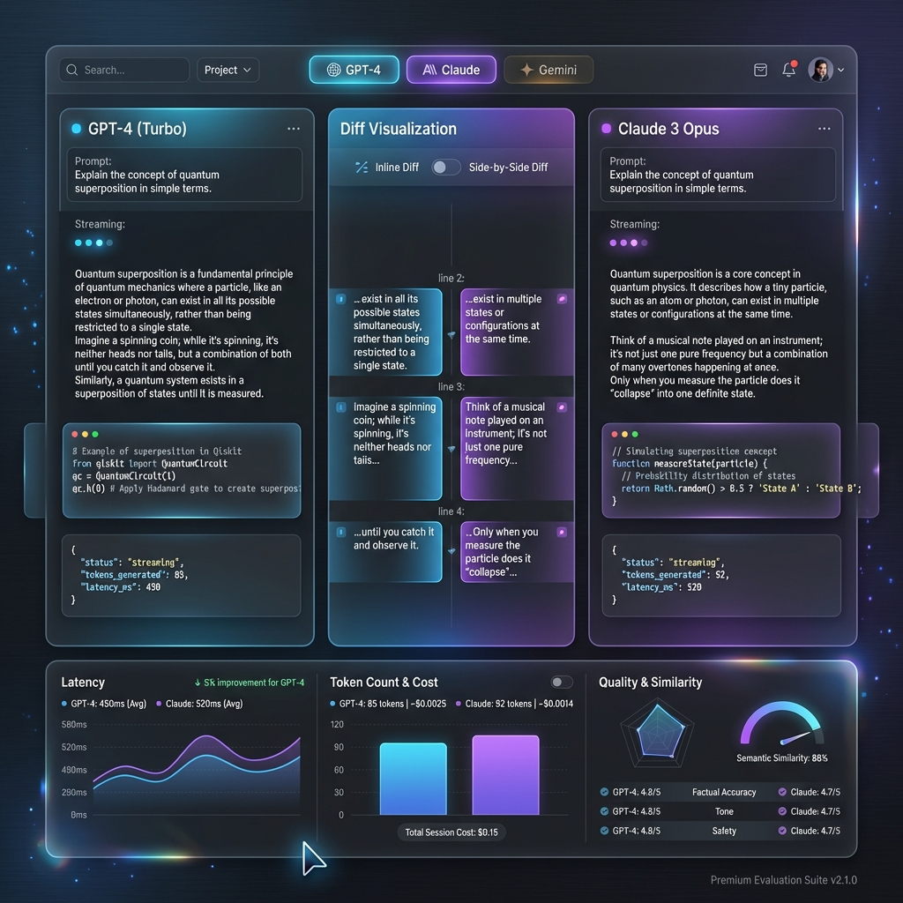
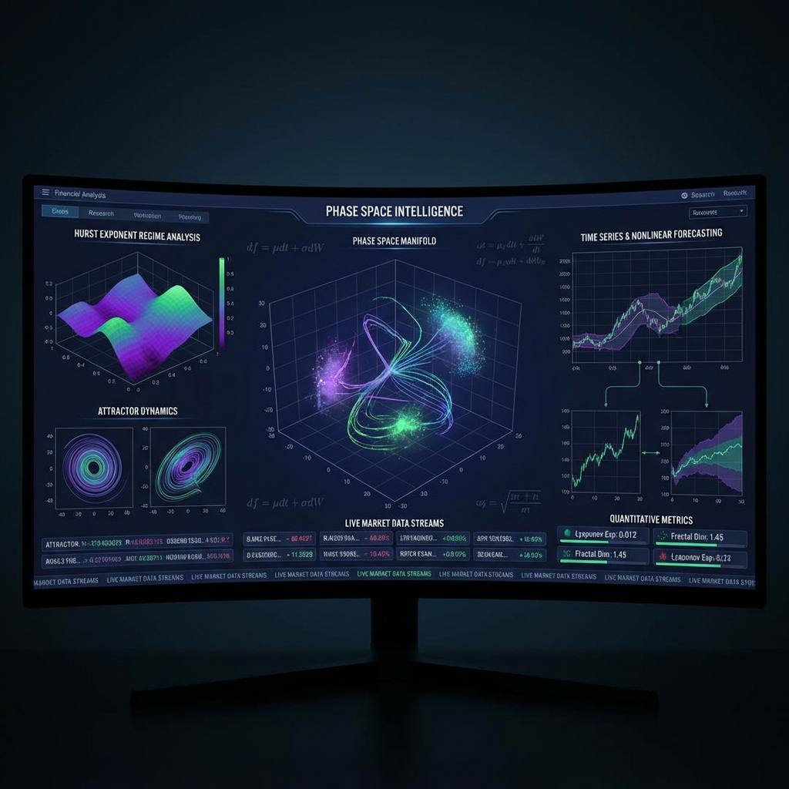
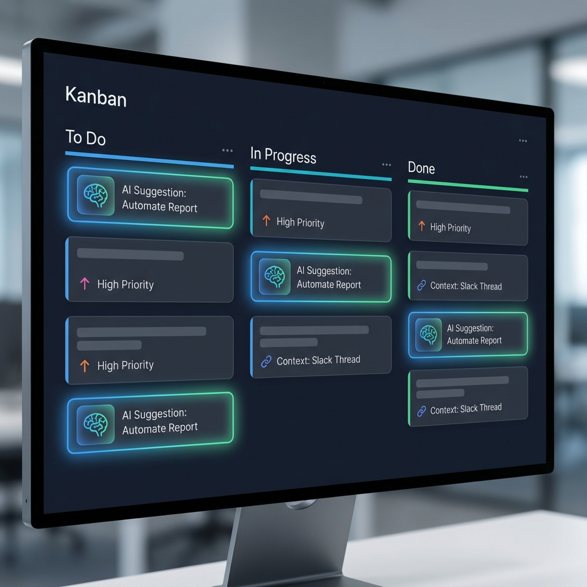
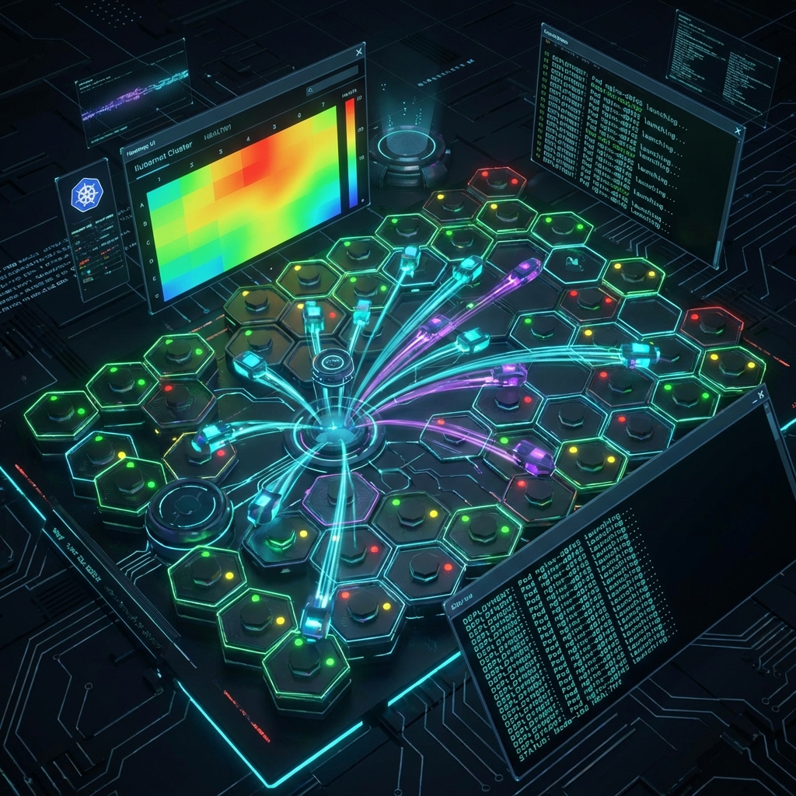
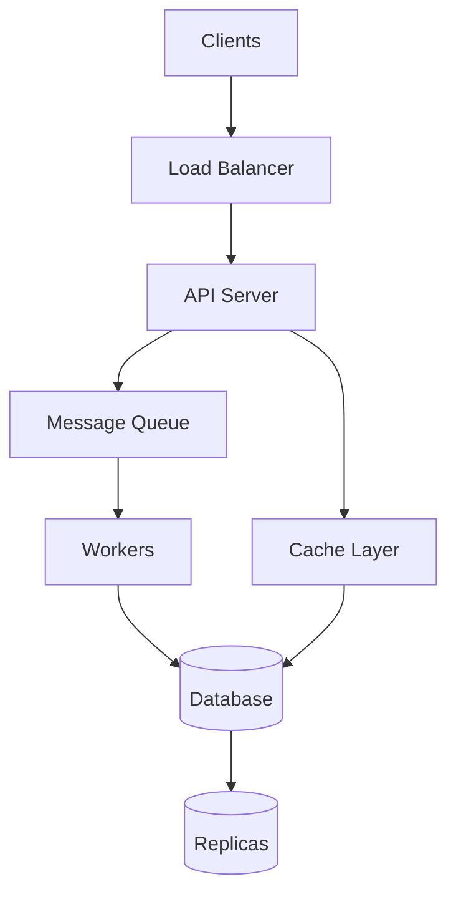
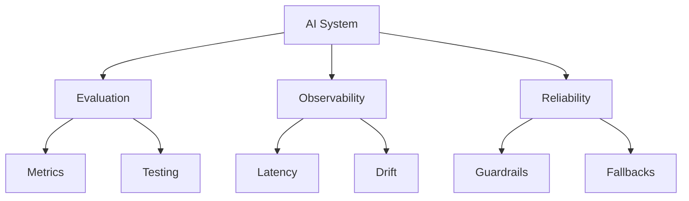
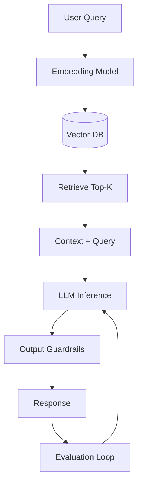

# 👋 Hi, I'm Ananth

**Member of Technical Staff**  
_AI Infrastructure · Distributed Systems · Production ML_

> "Most engineers are either great at ML or great at systems. I'm exceptional at both—and I know how to make them work together in production."

I bridge the gap between **ML research** and **resilient production systems**.  
My focus is on reliability, evaluation, and correctness under uncertainty.

```python
while alive:
    learn(0.01)  # 1% better every day
    evolve()
    contribute_to(world.connection + world.growth + world.peace)
# Mission: Advancing human intelligence through code and connection
```

---

<div align="center">
  
</div>

---

## 🏗️ What I Work On

I design and build production-grade AI systems where large models meet real-world constraints.
I am especially focused on **turning stochastic AI behavior into predictable system outcomes**.

My background spans distributed systems, cloud platforms, and high-throughput APIs, with deep expertise in Python-based AI infrastructure on AWS and GCP. I care less about demos — and more about **evaluation, observability, and reliability**.

### Core Focus Areas

- **AI Infrastructure**: LLM-backed services, RAG pipelines, and Agentic orchestration.
- **Production Readiness**: Model serving, inference optimization, and cost controls.
- **Reliability Engineering**: Guardrails, fallbacks, and human-in-the-loop patterns for non-deterministic systems.
- **Distributed Systems**: Event-driven architectures (Kafka) and high-throughput APIs (gRPC/REST).

### Tech Stack

<div align="center">

<table>
<tr>
<td align="center" width="25%">
<br>
<sub><b>Languages</b></sub><br>
<sub>Python • Java • C# • JS/TS</sub>
</td>
<td align="center" width="25%">
<br>
<sub><b>AI/ML Frameworks</b></sub><br>
<sub>PyTorch • TensorFlow • scikit-learn</sub>
</td>
<td align="center" width="25%">
<br>
<sub><b>Cloud & Infrastructure</b></sub><br>
<sub>AWS • Azure • GCP • K8s • Docker</sub>
</td>
<td align="center" width="25%">
<br>
<sub><b>Data & Streaming</b></sub><br>
<sub>Kafka • Redis • SQL • NoSQL</sub>
</td>
</tr>
</table>

### AI Infrastructure Specializations

| 🤖 **LLM & Agentic Systems** | 🔍 **RAG & Search** | ⚡ **Production ML** | 🏗️ **Distributed Systems** |
|:---:|:---:|:---:|:---:|
| LLM orchestration | Vector databases | Model serving | Event-driven architectures |
| Agent frameworks | Semantic search | Inference optimization | High-throughput APIs |
| Tool-use patterns | Retrieval pipelines | Cost controls | gRPC • REST • ProtoBuf |
| Prompt engineering | Embedding models | A/B testing | Sharding • Partitioning |

</div>

---

## 🧪 Featured Projects

<div align="center">

<table>
<tr>
<td width="33%" align="center" valign="top">

<a href="https://ananthx.dev">

</a>
<br>

**[ananthx.dev](https://ananthx.dev)**
<br>
<sub><i>Personal Universe & Portfolio</i></sub>
<br>
<sub>Multi-themed AI portfolio with dynamic particle systems and 10 distinct visual themes.</sub>
<br><br>
 

</td>
<td width="33%" align="center" valign="top">

<a href="https://archdivine.vercel.app">

</a>
<br>

**[ArchDivine](https://archdivine.vercel.app)**
<br>
<sub><i>3D Architecture Renderer</i></sub>
<br>
<sub>Turns Mermaid syntax into navigable 3D architecture explorations for Staff+ engineers.</sub>
<br><br>
 

</td>
<td width="33%" align="center" valign="top">

<a href="https://llmvibe.vercel.app">

</a>
<br>

**[LLM Vibe](https://llmvibe.vercel.app)**
<br>
<sub><i>LLM Evaluation Tool</i></sub>
<br>
<sub>Compare GPT-4, Claude & Gemini side-by-side with structured diff views.</sub>
<br><br>
 

</td>
</tr>
<tr>
<td width="33%" align="center" valign="top">

<a href="https://nowiknowyou.vercel.app">

</a>
<br>

**[NowIKnow](https://nowiknowyou.vercel.app)**
<br>
<sub><i>Quant Innovation Lab</i></sub>
<br>
<sub>Phase Space Reconstruction & Hurst Analysis for market regime detection.</sub>
<br><br>
 

</td>
<td width="33%" align="center" valign="top">

<a href="https://aims-ivory.vercel.app">

</a>
<br>

**[AIMS](https://aims-ivory.vercel.app)**
<br>
<sub><i>Context-Aware Task AI</i></sub>
<br>
<sub>Productivity system that auto-categorizes tasks using LLM-backed intelligence.</sub>
<br><br>
 

</td>
<td width="33%" align="center" valign="top">

<a href="https://caece.vercel.app">

</a>
<br>

**[CAECE](https://caece.vercel.app)**
<br>
<sub><i>Infra Control Plane</i></sub>
<br>
<sub>Ephemeral dev environments management. Think Vercel meets Kubernetes.</sub>
<br><br>
 

</td>
</tr>
</table>

</div>

---

## 🎨 System Design Expertise

I think in systems. Here's how I visually break down complex architectures:

<div align="center">

<table>
<tr>
<td width="33%" align="center">

**Distributed Systems**



<sub>Scalable web services</sub>

</td>
<td width="33%" align="center">

**AI Infrastructure**



<sub>Production ML systems</sub>

</td>
<td width="34%" align="center">

**RAG/LLM Architecture**



<sub>Perplexity/ChatGPT-style RAG</sub>

</td>
</tr>
</table>

**Architecture Competencies:** Scalable Web Services • Production ML Infrastructure • RAG Pipelines • Vector Search • LLM Orchestration • Real-time Inference • Evaluation-Driven Development • Distributed Tracing • Load Balancing • Reliability Engineering

</div>

---

## 🚀 Experience

I've led 0→1 AI systems at scale.
For detailed case studies of my work at **Costco Wholesale** (Forecasting with LLMs) and **NYC DOT** (Digital Twin Infrastucture), explore my interactive portfolio:

<div align="center">
  <a href="https://ananthx.dev">
    
  </a>
</div>

---

## 💡 Philosophy

AI systems fail differently than traditional software. My job is to make those failures observable, bounded, and recoverable.

**Principles I design around:**

- **Reliability First**: In distributed systems, assume failure is the default, not the exception.
- **Separate invariants from intelligence**: Keep business logic deterministic.
- **Empathy driven**: The difference between good and great engineers is empathy for the next developer.
- **Simplicity**: Code is poetry written for machines to execute and humans to understand.

---

## 🌐 Let's Connect

<div align="center">

<table>
<tr>
<td align="center" width="33%">
<a href="https://linkedin.com/in/ananthpesaru">

<br><sub><b>Professional Network</b></sub>
</a>
</td>
<td align="center" width="33%">
<a href="mailto:ananth.pesaru@gmail.com">

<br><sub><b>ananth.pesaru@gmail.com</b></sub>
</a>
</td>
<td align="center" width="34%">
<a href="https://ananthpesaru.vercel.app/">

<br><sub><b>Live Projects & Work</b></sub>
</a>
</td>
</tr>
</table>

[](https://x.com/AwesomeAnanth)

</div>

---

<div align="center">
  <i>"The hard part isn't making models smarter — it's making systems trustworthy."</i>
  <br><br>
  <b>🌍 My Mission</b><br>
  <sub>Dedicated to advancing humanity to the next level of intelligence through global collaboration.<br>
  I strive to evolve by learning 1% every day, using Computer Science to build a more peaceful and connected world.</sub>
</div>

---

<div align="center">
  
</div>
