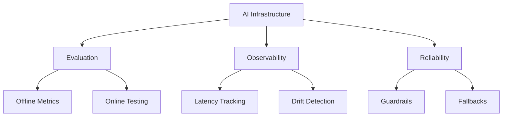
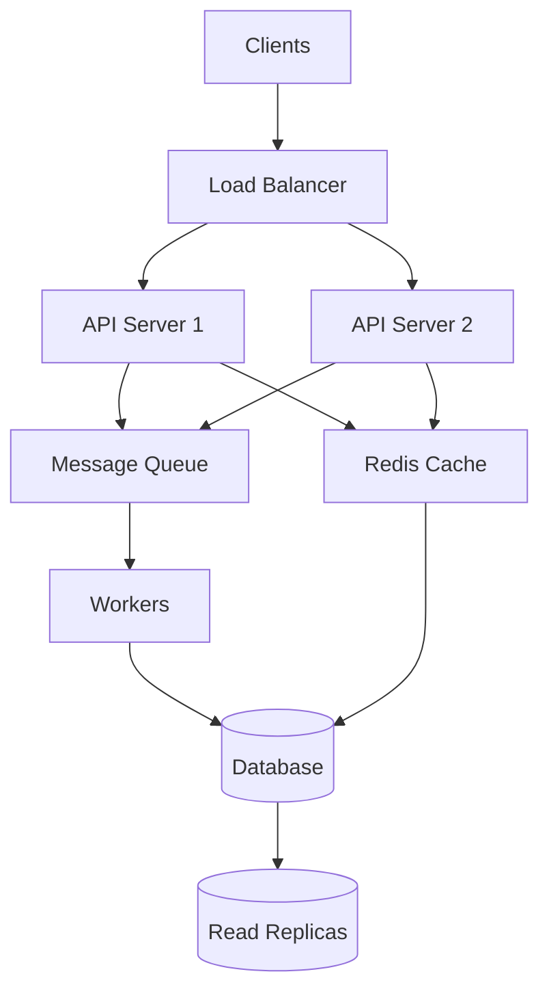
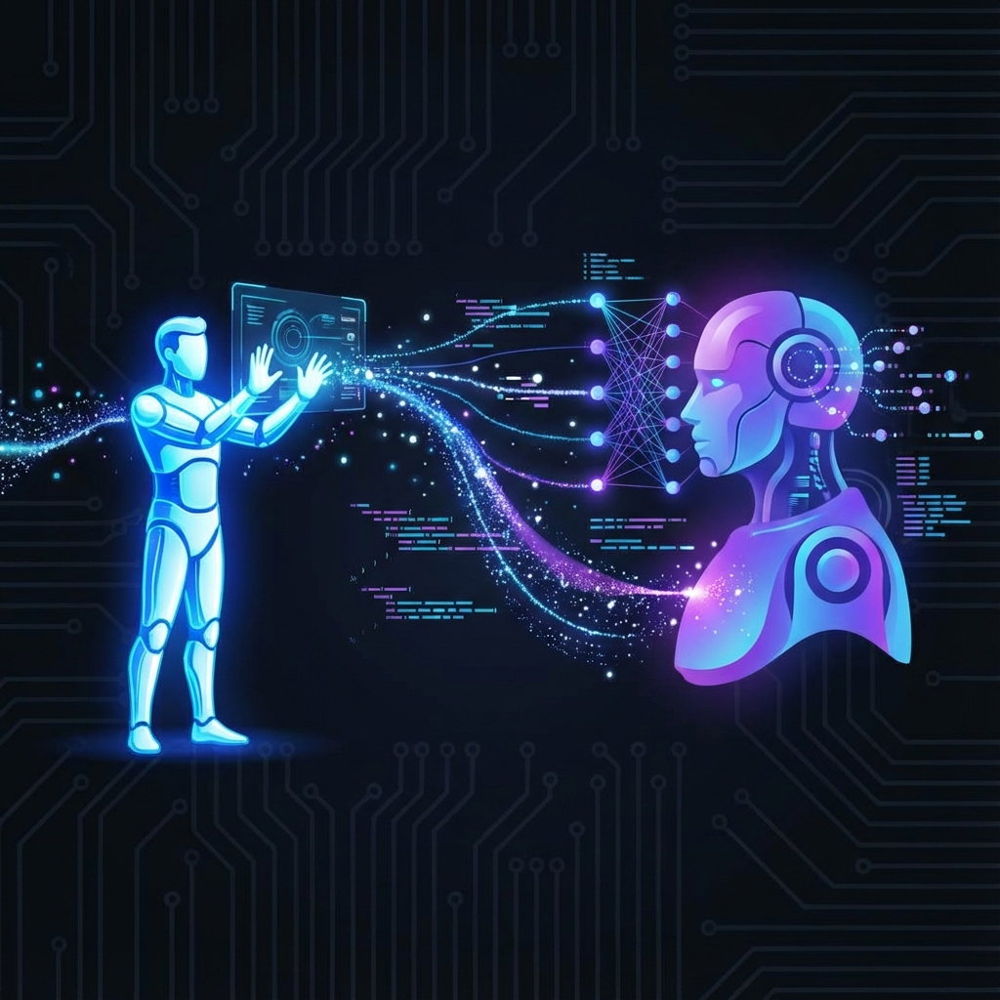

# 👋 Hi, I'm Ananth

**AI Infrastructure & Distributed Systems Engineer**  
LLM Platforms • RAG • Agentic Systems • Building reliable systems for probabilistic intelligence

```python
while alive:
    learn(0.01)  # 1% better every day
    evolve()
    contribute_to(world.connection + world.growth + world.peace)
# Mission: Advancing human intelligence through code and connection
```

## 🧠 Focus Areas

- AI Infrastructure & LLM Platforms
- Machine Learning Engineering & MLOps
- Evaluation-Driven Development (EDD)
- Retrieval-Augmented Generation (RAG)
- Agentic Systems & Tooling
- Distributed Systems & Reliability

## 🏗️ What I Work On

I design and build production-grade AI systems where large models meet real-world constraints.

My background spans distributed systems, cloud platforms, and high-throughput APIs, with recent focus on LLM-backed services, RAG pipelines, and agentic workflows. **I've worked across multiple stacks, with deep expertise in Python-based AI infrastructure on AWS and GCP.** I care less about demos — and more about evaluation, observability, and reliability.

I'm especially interested in:

- Turning stochastic AI behavior into predictable system outcomes
- Designing platforms that let teams experiment safely
- Bridging classical distributed systems with modern AI infrastructure

## 🔬 Current Focus Areas

**AI Infrastructure**
- LLM-backed services (RAG, tool use, agent orchestration)
- Evaluation-driven development (offline + online)
- Model serving, inference optimization, and cost controls

**Distributed Systems**
- Event-driven architectures (Kafka-style pipelines)
- High-throughput, low-latency APIs (REST / gRPC)
- Concurrency, sharding, partitioning, failure isolation

**Production Readiness**
- Observability for AI systems (latency, drift, token usage, failure modes)
- Guardrails, fallbacks, and human-in-the-loop patterns
- Safe rollout strategies for non-deterministic systems

## 💡 How I Think About AI Systems

AI systems fail differently than traditional software.  
My job is to make those failures observable, bounded, and recoverable.

**Principles I design around:**

- **Separate invariants from intelligence** — keep business logic deterministic
- **Evaluate before you scale** — measure behavior, not just accuracy
- **Assume uncertainty** — design for ambiguity, not perfection
- **Prefer boring infra** — reliability beats novelty in production

## 💻 Tech Stack

<div align="center">

### Core Engineering Stack

<table>
<tr>
<td align="center" width="25%">
<br>
<sub><b>Languages</b></sub><br>
<sub>Python • Java • C# • JS/TS</sub>
</td>
<td align="center" width="25%">
<br>
<sub><b>AI/ML Frameworks</b></sub><br>
<sub>PyTorch • TensorFlow • scikit-learn</sub>
</td>
<td align="center" width="25%">
<br>
<sub><b>Cloud & Infrastructure</b></sub><br>
<sub>AWS • Azure • GCP • K8s • Docker</sub>
</td>
<td align="center" width="25%">
<br>
<sub><b>Data & Streaming</b></sub><br>
<sub>Kafka • Redis • SQL • NoSQL</sub>
</td>
</tr>
</table>

### AI Infrastructure Specializations

| 🤖 **LLM & Agentic Systems** | 🔍 **RAG & Search** | ⚡ **Production ML** | 🏗️ **Distributed Systems** |
|:---:|:---:|:---:|:---:|
| LLM orchestration | Vector databases | Model serving | Event-driven architectures |
| Agent frameworks | Semantic search | Inference optimization | High-throughput APIs |
| Tool-use patterns | Retrieval pipelines | Cost controls | gRPC • REST • ProtoBuf |
| Prompt engineering | Embedding models | A/B testing | Sharding • Partitioning |

### System Design Expertise

<table>
<tr>
<td width="50%" align="center">

**AI Infrastructure Design**



</td>
<td width="50%" align="center">

**Distributed Systems Architecture**



</td>
</tr>
</table>

**Key Competencies:** Production ML Systems • Evaluation-Driven Development • Scalable Web Services • Observability • Reliability Engineering • Distributed Tracing • Load Balancing • Concurrency Control • Event-Driven Architectures

</div>

## 🚧 Current Work

Currently building reference implementations for production AI systems. **Reach out to discuss my production work, system design decisions, and infrastructure tradeoffs.**

<!--
## 🧪 What You'll Find in My Repos (Disabled - enable when repos are ready)

Rather than toy projects, my repositories tend to focus on:

- Infrastructure patterns for AI systems
- Reference architectures for RAG and agent workflows
- Evaluation harnesses for LLM behavior
- Design notes on scaling, reliability, and tradeoffs

I value clarity over cleverness and design rationale over flash.
-->


## 🔍 Open Source & Learning

I actively explore and learn from:

- Agent frameworks and orchestration patterns
- LLM evaluation tooling
- Distributed data and inference pipelines

When I contribute, it's usually around infrastructure, correctness, or system boundaries rather than surface features.

## 🎯 What I'm Optimizing For

- Building systems that age well
- Making AI behavior measurable
- Reducing operational risk as intelligence increases
- Helping teams move faster without losing control

## 🌐 Let's Connect

<div align="center">
  
</div>

<div align="center">
  
### 📬 Reach Out
  
<table>
<tr>
<td align="center" width="33%">
<a href="https://linkedin.com/in/ananthpesaru">

<br><sub><b>Professional Network</b></sub>
</a>
</td>
<td align="center" width="33%">
<a href="mailto:ananth.pesaru@gmail.com">

<br><sub><b>ananth.pesaru@gmail.com</b></sub>
</a>
</td>
<td align="center" width="34%">
<a href="https://ananthpesaru.vercel.app/">

<br><sub><b>Live Projects & Work</b></sub>
</a>
</td>
</tr>
</table>

[](https://x.com/AwesomeAnanth)

</div>

---

<div align="center">
  <i>"The hard part isn't making models smarter — it's making systems trustworthy."</i>
  <br><br>
  <b>🌍 My Mission</b><br>
  <sub>Dedicated to advancing humanity to the next level of intelligence through global collaboration.<br>
  I strive to evolve by learning 1% every day, using Computer Science to build a more peaceful and connected world.</sub>
</div>

---

<div align="center">
  
</div>

<!--
## 📈 GitHub Activity (Optional)

<div align="center">
  
  
</div>
-->
